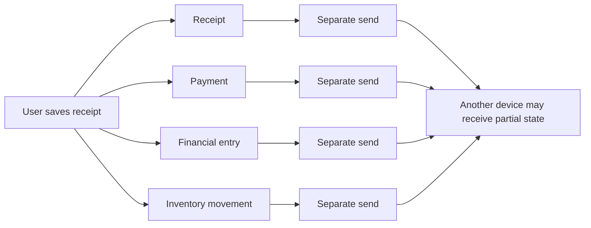
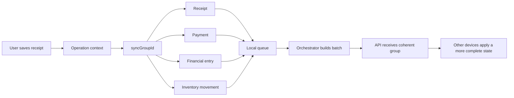

# Grouped Batch Offline-First Sync

## Reducing orphan records in multi-device offline-first applications

This document describes a practical offline-first synchronization method based on grouped batches. It comes from a real problem: in a multi-device application, a single user action can create several related records. When those records are synchronized independently, other devices may receive only part of the operation.

Example: saving a receipt may create or update the receipt itself, a payment, a financial entry, and inventory movements. If each record is sent as an isolated sync item, another device may see a locally valid but globally incomplete state.

Grouped Batch Offline-First Sync organizes local changes into logical operation groups while still sending them through technical batches.

## The problem

Offline-first applications usually accept local writes before the network is available. This is great for user experience, but it makes synchronization hard.

The hard part is not only sending data later. The harder part is preserving the meaning of a business operation when that operation is represented by multiple records.

Examples:

- A receipt creates a payment and a financial entry.
- A sale creates an order, payment, inventory updates, and history.
- A table order creates orders, items, and status changes.
- A deletion may require related reversals or cleanup records.

If each entity is queued and synchronized independently, common failure modes appear:

- a payment arrives without the corresponding receipt;
- a financial entry points to a reference that does not exist yet;
- inventory is updated without the sale or receipt that caused the movement;
- another device displays half of the operation;
- remote conflicts are resolved for one record but not for related records.

These failures are what this document calls orphan records or incomplete operations.

## Core idea

The method uses four components:

1. A local change queue.
2. An operation group identifier.
3. Technical batching.
4. A sync orchestrator that preserves groups inside batches.

Instead of treating every record as a completely independent operation, related records receive the same `syncGroupId`.

When one user action creates several side effects, all related queue items carry the same operation group. The sync engine still sends batches, but it avoids splitting records from the same group across different batches.

## Overview

Without grouping, each record may travel independently. This increases the chance that another device receives only part of the business operation.



With grouped batches, records remain independent in storage, but they carry the same operation context.



## How it works

### 1. A user action opens a sync operation context

When a composite operation starts, the application creates a group:

```dart
final groupId = CloudSyncOperationContext.createGroupId(
  type: 'receipt-create',
  rootId: receipt.id,
);
```

Then the operation runs inside that context:

```dart
await CloudSyncOperationContext.run(
  groupId: groupId,
  groupType: 'receipt-create',
  action: () async {
    await saveReceipt();
    await syncPayment();
    await syncFinancialEntry();
    await updateInventory();
  },
);
```

In the current implementation, `CloudSyncOperationContext` uses Dart `Zone` values to keep the operation context available across asynchronous calls.

### 2. Each local change enters the queue with the same group

When a model saves a local change, the queue layer reads the active operation context. If a group exists, the payload receives metadata:

```json
{
  "_syncGroupId": "receipt-create:123:1778920000000",
  "_syncGroupType": "receipt-create"
}
```

The queue extracts and stores this metadata as part of the queue item. The business payload can still be normalized before being sent to the server.

### 3. The orchestrator builds batches without breaking groups

The orchestrator reads pending items and splits them into batches. Before closing a batch, it checks whether the next item belongs to a group.

If it does, the orchestrator includes the other pending items with the same `syncGroupId` in the same batch.

Pseudocode:

```text
for each pending item:
  if item was already consumed:
    continue

  if item has syncGroupId:
    nextItems = all pending items with the same syncGroupId
  else:
    nextItems = only this item

  if nextItems do not fit in the current batch:
    flush current batch

  add nextItems to current batch
  mark nextItems as consumed

flush last batch
send each batch to the API
```

A minimal example independent from the application is available at `docs/examples/grouped_batch_sync_example.dart`. It shows the local queue, operation context, `syncGroupId`, and orchestrator preserving groups inside batches.

Expected output:

```text
Batch 1 (3 records)
- receipts:receipt-001 action=upsert group=receipt-create / receipt-create:receipt-001:...
- payments:payment-001 action=upsert group=receipt-create / receipt-create:receipt-001:...
- financial_entries:entry-001 action=upsert group=receipt-create / receipt-create:receipt-001:...

Batch 2 (2 records)
- products:product-001 action=upsert group=no-group
- customers:customer-001 action=upsert group=no-group
```

Even with `batchSize: 2`, the first batch sends 3 records because they belong to the same logical group. This is the central point of the method: the technical batch limit should not break a composite business operation.

### 4. The server receives a more coherent set

The server receives related records together. This does not remove the need for validation, versioning, conflict handling, idempotency, or transactions. It does reduce the chance that another device observes a half-synchronized business operation.

## Technical batches vs. logical grouped batches

There are two similar but different ideas.

### Technical batch

A technical batch controls volume, performance, and request size.

Examples:

- send at most 40 records at a time;
- limit the request body to 512 KB;
- reduce timeout and API load.

### Logical grouped batch

A logical grouped batch preserves the consistency of a business operation.

Examples:

- receipt, payment, and financial entry should travel together;
- order and items should share the same operation group;
- deletion and reversal records should remain related.

The key idea is to combine both: use technical batches while respecting logical groups.

## Benefits

- Reduces orphan records.
- Reduces incomplete states across devices.
- Keeps composite operations more coherent.
- Makes sync failures easier to trace by operation group.
- Makes offline-first synchronization more predictable.
- Keeps the application usable while offline.
- Works with a local queue and later synchronization.

## Limits

This method does not solve every offline-first synchronization problem. It solves an important class of problems: inconsistencies caused by synchronizing composite operations as isolated records.

You still need:

- per-record versioning;
- conflict policy;
- server-side validation;
- idempotent endpoints;
- deletion semantics;
- retry handling;
- a strategy for very large groups;
- observability for rejected records and failed groups.

This limitation is important. The method is strongest when it is presented as a practical technique for one recurring sync failure mode, not as a universal cure for offline-first complexity.

## Suggested public positioning

Avoid presenting the method as "solving all offline-first synchronization." A more defensible statement is:

> I ran into a recurring offline-first problem: composite operations created orphan records when synchronized record by record. I adopted an operation-grouped batching strategy using `syncGroupId`, a local queue, and an orchestrator that preserves groups inside technical batches. This reduced incomplete states across devices and made synchronization more predictable.

## Suggested article title

> Grouped Batch Sync: reducing orphan records in offline-first applications

## Suggested article outline

1. The hidden difficulty of offline-first synchronization
2. Why record-by-record sync breaks composite operations
3. Introducing operation groups
4. Preserving groups inside technical batches
5. A real example: receipt, payment, and financial entry
6. Failure handling and conflict resolution
7. What this approach solves and what it does not
8. Implementation notes
9. Conclusion

## Next steps

- Review and publish the minimal Dart example.
- Add before/after failure scenarios.
- Measure orphan or incomplete states before and after grouping.
- Publish the first version on Dev.to, Hashnode, Medium, or a GitHub repository.
- Later adapt it for DZone, InfoQ, or a more formal software engineering publication.
