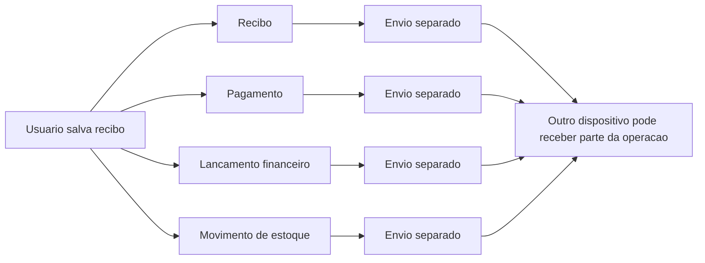
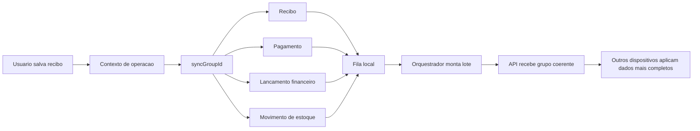

# Grouped Batch Offline-First Sync

## Evitando dados orfaos em aplicacoes offline-first multi-dispositivo

Este documento descreve um metodo pratico de sincronizacao offline-first baseado em lotes agrupados. A ideia nasceu de um problema real: em um aplicativo usado em mais de um dispositivo, uma unica acao do usuario podia gerar varios registros relacionados. Quando esses registros eram sincronizados separadamente, era comum aparecerem dados orfaos, incompletos ou fora de ordem.

Exemplo: salvar um recibo pode criar ou atualizar o recibo, um pagamento, um lancamento financeiro e movimentacoes de estoque. Se cada registro for enviado isoladamente, outro dispositivo pode receber apenas uma parte da operacao. O resultado e um sistema localmente valido em um aparelho, mas inconsistente no restante da rede.

O metodo proposto organiza essas alteracoes em lotes logicos, preservando o vinculo entre registros que fazem parte da mesma operacao de negocio.

## Problema

Aplicacoes offline-first normalmente precisam aceitar escrita local mesmo sem conexao imediata. Isso melhora a experiencia do usuario, mas cria um desafio dificil: sincronizar depois sem quebrar a consistencia dos dados.

O problema fica maior quando uma acao do usuario nao corresponde a um unico registro.

Alguns exemplos:

- Um recibo gera pagamento e lancamento financeiro.
- Uma venda gera pedido, pagamento, estoque e historico.
- Uma comanda gera pedidos, itens e atualizacoes de status.
- Uma exclusao pode exigir remocao ou estorno de registros dependentes.

Se cada entidade entra na fila de sincronizacao de forma independente, podem ocorrer falhas como:

- pagamento sincronizado sem o recibo correspondente;
- lancamento financeiro apontando para uma referencia que ainda nao existe;
- estoque atualizado sem a venda/recibo que justificou a movimentacao;
- outro dispositivo exibindo uma operacao pela metade;
- conflitos remotos resolvidos em uma parte da operacao, mas nao nas demais.

Esse tipo de falha gera o que chamamos aqui de dados orfaos ou operacoes incompletas.

## Ideia central

O metodo usa quatro componentes:

1. Fila local de alteracoes.
2. Identificador de grupo para operacoes compostas.
3. Envio em lotes.
4. Orquestrador que preserva grupos dentro dos lotes.

Em vez de tratar cada registro como uma operacao independente, o sistema associa registros relacionados a um mesmo `syncGroupId`.

Assim, quando uma acao cria varios efeitos colaterais, todos eles carregam o mesmo identificador de grupo. O envio para a nuvem continua acontecendo em lotes, mas o orquestrador evita separar registros do mesmo grupo entre lotes diferentes.

## Visao geral

Sem agrupamento, cada registro pode viajar sozinho. Isso aumenta o risco de outro dispositivo receber uma operacao de negocio incompleta.



Com lote agrupado, os registros continuam sendo independentes no armazenamento, mas passam a carregar o mesmo contexto de operacao.



## Como funciona

### 1. A acao do usuario abre um contexto de sincronizacao

Quando uma operacao composta comeca, o sistema cria um grupo:

```dart
final groupId = CloudSyncOperationContext.createGroupId(
  type: 'recibo-criar',
  rootId: recibo.id,
);
```

Depois, a acao roda dentro desse contexto:

```dart
await CloudSyncOperationContext.run(
  groupId: groupId,
  groupType: 'recibo-criar',
  action: () async {
    await salvarRecibo();
    await sincronizarPagamento();
    await sincronizarLancamentoFinanceiro();
    await atualizarEstoque();
  },
);
```

No projeto atual, essa logica aparece em `CloudSyncOperationContext`, que usa `Zone` para manter o contexto ativo durante a execucao assincrona.

### 2. Cada alteracao local entra na fila com o mesmo grupo

Quando um model salva uma alteracao local, o enfileiramento consulta o contexto atual. Se houver um grupo ativo, o payload recebe metadados:

```json
{
  "_syncGroupId": "recibo-criar:123:1778920000000",
  "_syncGroupType": "recibo-criar"
}
```

Esses metadados sao extraidos e armazenados no item da fila. O payload de negocio continua limpo para envio, mas a fila preserva a informacao de agrupamento.

### 3. O orquestrador monta lotes sem quebrar grupos

O orquestrador pega os itens pendentes e divide o envio em lotes. A diferenca e que, antes de fechar um lote, ele verifica se o proximo item pertence a um grupo.

Se pertence, ele inclui os demais itens do mesmo `syncGroupId` no mesmo lote.

Pseudocodigo:

```text
para cada item pendente:
  se item ja foi consumido:
    continuar

  se item tem syncGroupId:
    proximos = todos os itens pendentes com o mesmo syncGroupId
  senao:
    proximos = apenas este item

  se proximos nao cabem no lote atual:
    fechar lote atual

  adicionar proximos ao lote atual
  marcar proximos como consumidos

fechar ultimo lote
enviar cada lote para a API
```

No projeto, essa etapa esta em `_chunkPendingItems`, dentro de `CloudSyncOrchestrator`.

Um exemplo minimo e independente do aplicativo esta em `docs/examples/grouped_batch_sync_example.dart`. Ele mostra a fila local, o contexto de operacao, o `syncGroupId` e o orquestrador preservando grupos dentro dos lotes.

Saida esperada do exemplo:

```text
Batch 1 (3 records)
- receipts:receipt-001 action=upsert group=receipt-create / receipt-create:receipt-001:...
- payments:payment-001 action=upsert group=receipt-create / receipt-create:receipt-001:...
- financial_entries:entry-001 action=upsert group=receipt-create / receipt-create:receipt-001:...

Batch 2 (2 records)
- products:product-001 action=upsert group=no-group
- customers:customer-001 action=upsert group=no-group
```

Mesmo com `batchSize: 2`, o primeiro lote envia 3 registros porque eles pertencem ao mesmo grupo logico. Esse e o ponto principal do metodo: o limite tecnico do lote nao deve quebrar uma operacao de negocio composta.

### 4. O servidor recebe um conjunto mais coerente

O servidor passa a receber registros relacionados no mesmo envio. Isso nao elimina a necessidade de validacao, controle de versao ou resolucao de conflitos, mas reduz bastante a chance de outro dispositivo receber uma operacao pela metade.

## Exemplo real: recibo, pagamento e lancamento

Antes do agrupamento, salvar um recibo podia gerar:

- `recibos:123`
- `pagamentos:456`
- `lancamentos:789`

Se cada item fosse enviado e aplicado separadamente, uma falha de rede, conflito ou atraso poderia deixar apenas parte da operacao visivel em outro dispositivo.

Com o metodo de lote agrupado:

- todos os registros recebem o mesmo `syncGroupId`;
- a fila preserva esse vinculo;
- o orquestrador monta o lote mantendo esses itens juntos;
- a API recebe a operacao como um conjunto mais completo.

No codigo atual, o fluxo de recibo explicita essa intencao:

```dart
// Mantem recibo, pagamento e lancamento financeiro no mesmo lote.
```

## Diferenca entre lote tecnico e lote logico

Existem dois conceitos parecidos, mas diferentes.

### Lote tecnico

Serve para controlar volume, performance e tamanho de payload.

Exemplo:

- enviar no maximo 40 registros por vez;
- limitar o corpo da requisicao a 512 KB;
- evitar timeout ou sobrecarga da API.

### Lote logico agrupado

Serve para preservar a consistencia de uma operacao de negocio.

Exemplo:

- recibo, pagamento e lancamento devem viajar juntos;
- pedido e itens devem ser sincronizados no mesmo grupo;
- uma exclusao e seus estornos devem permanecer relacionados.

O diferencial do metodo e combinar os dois: enviar em lotes tecnicos, mas respeitando grupos logicos.

## Beneficios

- Reduz dados orfaos.
- Reduz estados incompletos em outros dispositivos.
- Mantem operacoes compostas mais coerentes.
- Facilita rastrear falhas por grupo.
- Melhora a previsibilidade do offline-first.
- Permite continuar usando fila local e sincronizacao posterior.
- Nao exige que o app fique online para aceitar a operacao do usuario.

## Limites do metodo

Este metodo nao resolve todos os problemas de sincronizacao offline-first. Ele resolve uma classe importante de problemas: inconsistencias causadas por operacoes compostas sincronizadas como registros independentes.

Ainda sao necessarios:

- controle de versao por registro;
- politica de conflito;
- validacao no servidor;
- idempotencia nos endpoints;
- tratamento de exclusoes;
- retry de falhas;
- estrategia para grupos muito grandes;
- observabilidade para diagnosticar rejeicoes.

Essa honestidade e importante. A forca do metodo esta em atacar um problema real e recorrente sem prometer uma solucao magica para todo o universo offline-first.

## Possivel nome publico

Nomes possiveis:

- Grouped Batch Offline-First Sync
- Grouped Batch Sync
- Operation-Grouped Offline Sync
- Atomic-Like Batch Sync for Offline-First Apps

O termo "atomic-like" deve ser usado com cuidado. O metodo se comporta como uma operacao mais coesa no cliente e no envio, mas so sera realmente atomico se o servidor aplicar o lote em uma transacao.

## Como apresentar para a comunidade

Uma boa apresentacao publica deve focar menos em "eu criei uma tecnica que resolve tudo" e mais em:

> Encontrei um problema recorrente em apps offline-first: operacoes compostas geravam dados orfaos quando sincronizadas registro por registro. Adotei uma estrategia de lotes agrupados por operacao, usando `syncGroupId`, fila local e um orquestrador que preserva grupos dentro dos lotes. Isso reduziu estados incompletos entre dispositivos e tornou a sincronizacao mais previsivel.

Essa formulacao e forte, tecnica e defensavel.

## Estrutura sugerida para artigo

Titulo:

> Grouped Batch Sync: reducing orphan records in offline-first applications

Secoes:

1. The hidden difficulty of offline-first synchronization
2. Why record-by-record sync breaks composite operations
3. Introducing operation groups
4. Preserving groups inside technical batches
5. A real example: receipt, payment and financial entry
6. Failure handling and conflict resolution
7. What this approach solves and what it does not
8. Implementation notes
9. Conclusion

## Proximos passos

- Revisar a versao em ingles deste documento.
- Revisar e publicar o exemplo minimo em Dart puro.
- Medir cenarios de falha: antes e depois do agrupamento.
- Publicar primeiro em Dev.to, Medium ou Hashnode.
- Depois adaptar para DZone, InfoQ ou uma publicacao tecnica mais formal.
